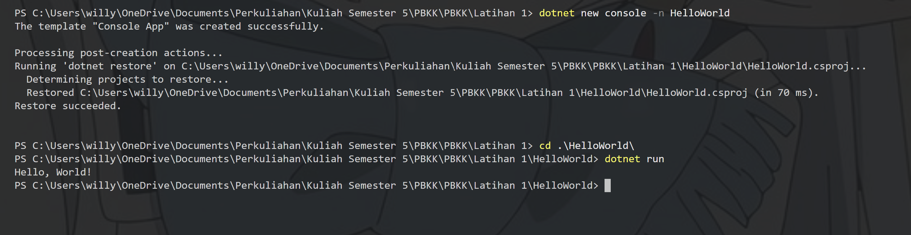
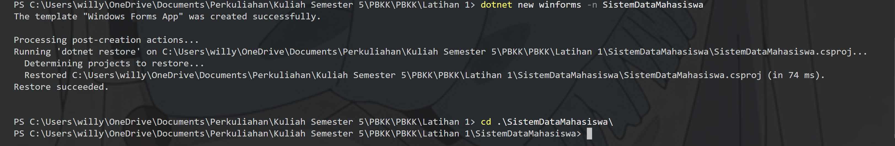
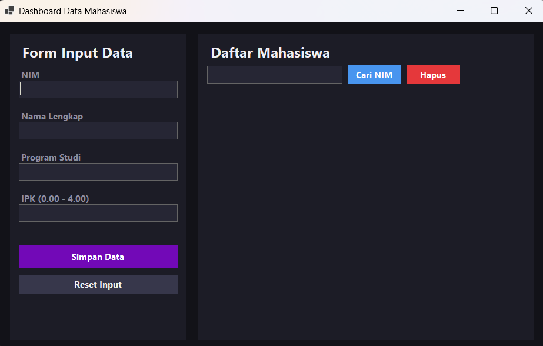
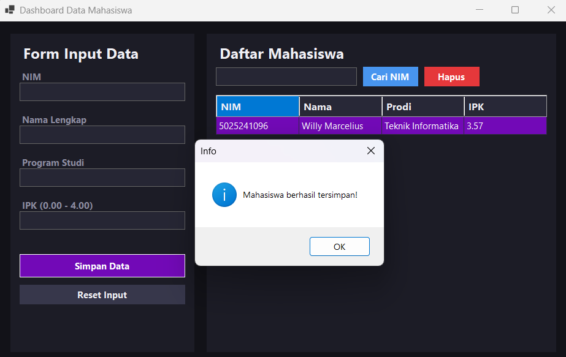
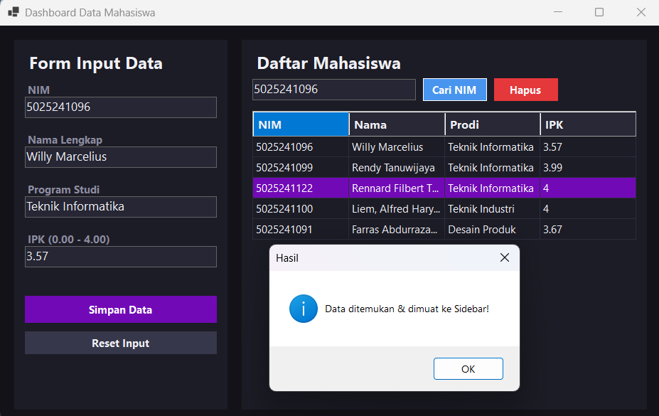
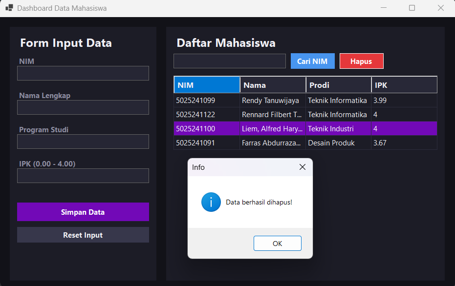
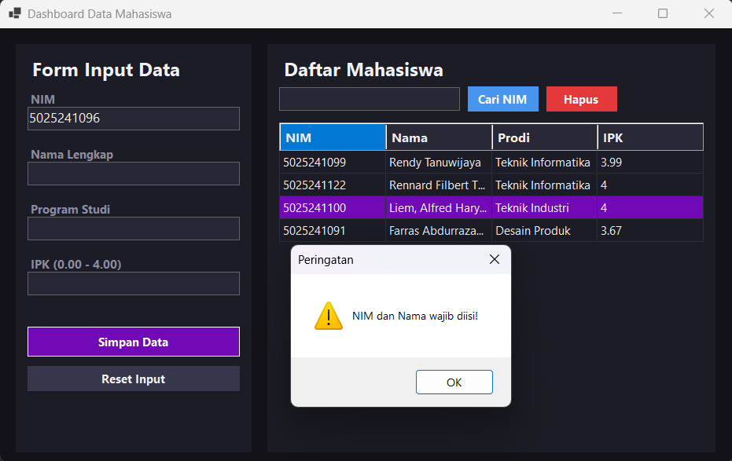
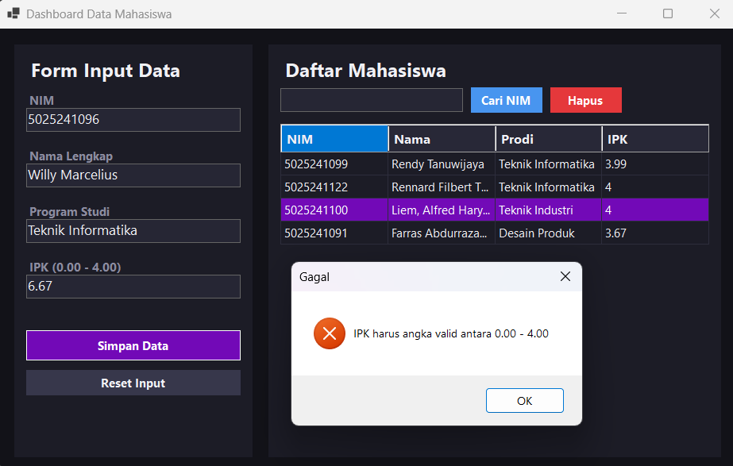
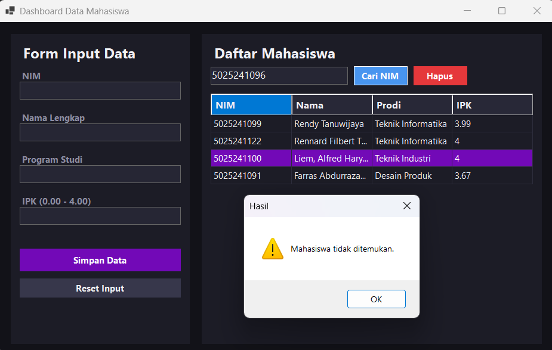
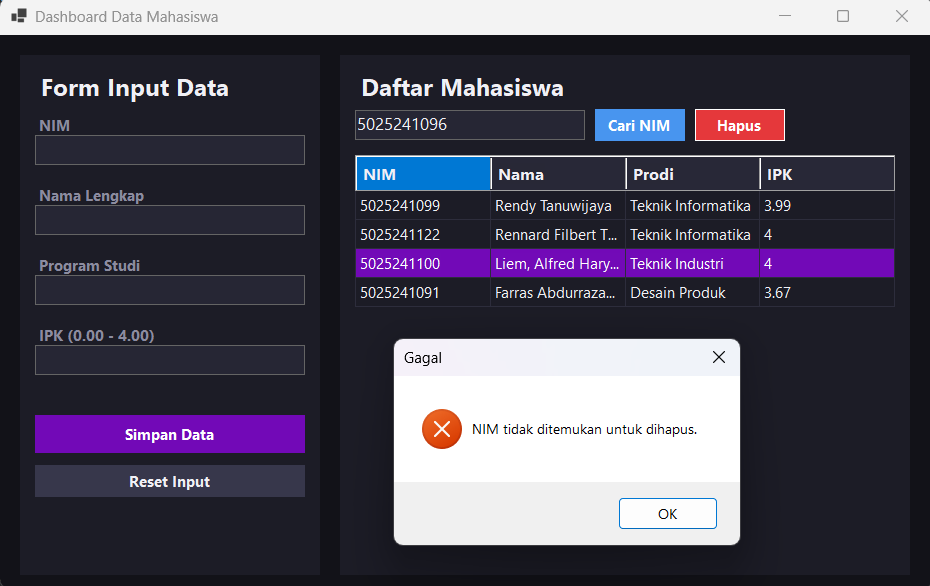

# Latihan 1 PBKK

| Nama | NRP | Mata Kuliah | Kelas | 
| --- | --- | --- | --- | --- |
| Willy Marcelius | 5025241096 | Pemrograman Berbasis Kerangka Kerja | D |


## 1. Hello World Console

Program console sederhana yang menampilkan teks "Hello, World!" di terminal untuk verifikasi setup environment .NET.

### Build & Run
1. Inisialisasi project console:
```
dotnet new console -n HelloWorld 
```

2. Masuk ke folder project dan jalankan:
```
cd HelloWorld
dotnet run
```



## 2. Sistem Data Mahasiswa (Desktop GUI)

Aplikasi desktop GUI berbasis **C# Windows Forms** untuk mengelola data mahasiswa (NIM, Nama, Program Studi, dan IPK).  
Didesain dengan **Modern Dark Mode Two-Column Dashboard** agar tampilan bersih, responsif, dan nyaman digunakan.

### Build dan Inisialisasi
1. Inisialisasi project winforms:
```
dotnet new winforms -n SistemDataMahasiswa 
```

2. Masuk ke folder project:
```
cd SistemDataMahasiswa
```



### Fitur Utama
- **Form Input Sidebar** → Panel kiri untuk input data mahasiswa.
- **Tabel Data Interactive** → Panel kanan menampilkan daftar mahasiswa dengan `DataGridView`.
- **Auto-Fill Input** → Klik baris tabel, data otomatis masuk ke form input.
- **Pencarian & Penghapusan** → Cari data berdasarkan NIM atau hapus data.
- **Validasi Data** → Pastikan NIM & Nama terisi, IPK valid (0.00 – 4.00).

### Tampilan Aplikasi
1. Tampilan Awal



2. Tambahkan Data



3. Mencari Data



4. Menghapus Data

Dapat dilihat data mahasiswa dengan NIM `5025241096` telah dihapus dari tabel


5. Akan muncul pesan / peringatan apabila input yang diberikan tidak valid atau tidak sesuai









### Struktur Proyek
| File                | Fungsi  |
|---------------------|--------------------------|
| **Mahasiswa.cs**    | Model data: class atribut mahasiswa (NIM, Nama, Prodi, IPK). |
| **MahasiswaService.cs** | Business logic: mengelola `List<Mahasiswa>`, tambah, cari, hapus. |
| **Form1.cs**        | User Interface: layout Dark Mode, event handler tombol & tabel. |
| **Program.cs**      | Entry point: menjalankan `Form1`. |

### Penjelasan Singkat Alur Kerja

- **Separation of Concerns** → Logika tampilan visual (UI) di `Form1.cs` dipisahkan penuh dari pengelolaan data di `MahasiswaService.cs`.
- **In-Memory Storage** → Data disimpan di dalam `List<Mahasiswa>` yang dikelola oleh `MahasiswaService` selama aplikasi berjalan.
- **Event-Driven Execution** → Setiap klik tombol pada `Form1` memanggil method pada service (`Tambah`, `CariByNim`, `HapusByNim`), lalu memperbarui tampilan `DataGridView`.
- **Auto-Fill Interaction** → Event `CellClick` pada tabel menangkap objek `Mahasiswa` yang dipilih dan langsung mengisi kembali seluruh field input di sidebar.