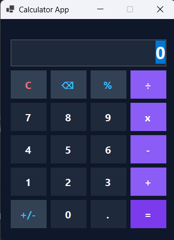
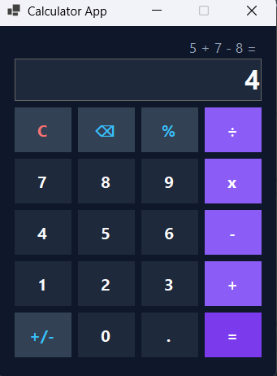
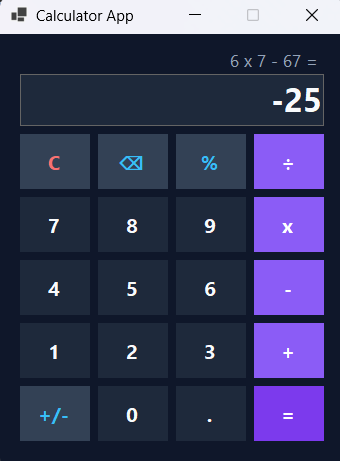
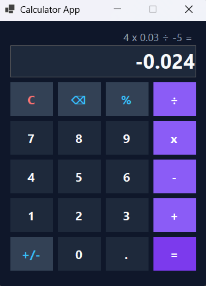
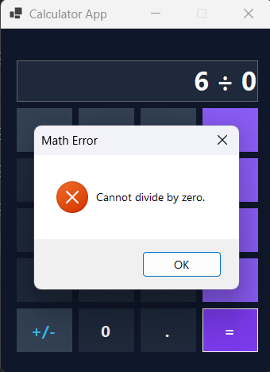

# Latihan 2 PBKK - Calculator Desktop App

| Nama | NRP | Mata Kuliah | Kelas |
| --- | --- | --- | --- |
| Willy Marcelius | 5025241096 | Pemrograman Berbasis Kerangka Kerja | D |


## Deskripsi

**Calculator Desktop App** adalah aplikasi kalkulator desktop berbasis **C# Windows Forms** yang dibangun menggunakan framework **.NET SDK**. Aplikasi ini dirancang dengan tema **Cyberpunk Slate Dark Theme**, dilengkapi **Dual-Line Display**, serta mendukung **Full Expression Parsing** (evaluasi persamaan matematika berantai sesuai urutan operasi).


## Build dan Inisialisasi

1. Inisialisasi project Windows Forms:
   ```bash
   dotnet new winforms -n KalkulatorSederhana
   ```

2. Masuk ke folder project:
   ```bash
   cd KalkulatorSederhana
   ```

3. Jalankan aplikasi:
   ```bash
   dotnet run
   ```

## Fitur Utama

- **Dual-Line Display**
  Label riwayat (`lblHistory`) menampilkan persamaan yang sedang diproses (misal `3 + 3 + 3 =`), sedangkan `txtDisplay` menampilkan input angka dan hasil akhir.

- **Full Expression Parsing & PEMDAS**
  Mendukung perhitungan berantai panjang (contoh: `3 + 3 + 3` atau `10 + 2 x 5`) dengan memperhitungkan urutan operasi matematika.

- **Fitur Utilitas Tambahan**
  Dilengkapi tombol **Backspace (⌫)**, **Sign Toggle (+/-)**, dan **Persen (%)**.

- **Error Handling & Validasi**
  Mencegah pembagian dengan nol (`DivideByZeroException`), penanganan format desimal ganda, dan otomatisasi pergantian operator berturut-turut.

## Tampilan Aplikasi

1. Tampilan Utama 



2. Operasi Perhitungan







3. Penanganan Error (Pembagian Nol / Invalid)



## Struktur Proyek

| File | Fungsi |
| --- | --- |
| `Form1.cs` | User Interface (GUI), skema warna Cyberpunk Slate, tata letak Dual-Line Display, serta logika parsing dan event handler tombol. |
| `Program.cs` | Entry Point: Menginisialisasi konfigurasi aplikasi dan menjalankan `Form1`. |

## Penjelasan Singkat Alur Kerja

1. **Full Expression Parsing Engine**
   Saat tombol sama dengan (`=`) ditekan, string ekspresi pada layar diubah ke format standar (`x` menjadi `*`, `÷` menjadi `/`) lalu dievaluasi menggunakan engine `System.Data.DataTable().Compute()` untuk menghasilkan perhitungan presisi sesuai aturan matematika.

2. **Dual-Display State Management**
   Variabel status `isCalculated` mengontrol perilaku antarmuka: ketika user mengetik angka baru setelah hasil keluar, layar akan mereset tampilan riwayat secara otomatis.

3. **Token & Operator Handling**
   Fitur `+/-`, `%`, dan desimal (`.`) beroperasi berbasis pencarian token kata terakhir (space-separated token) sehingga hanya memanipulasi operan aktif tanpa merusak seluruh baris ekspresi.

4. **Consecutive Operator Prevention**
   Menekan tombol operator secara berturut-turut (misal `+` lalu `x`) akan langsung mengganti operator sebelumnya tanpa merusak urutan teks.