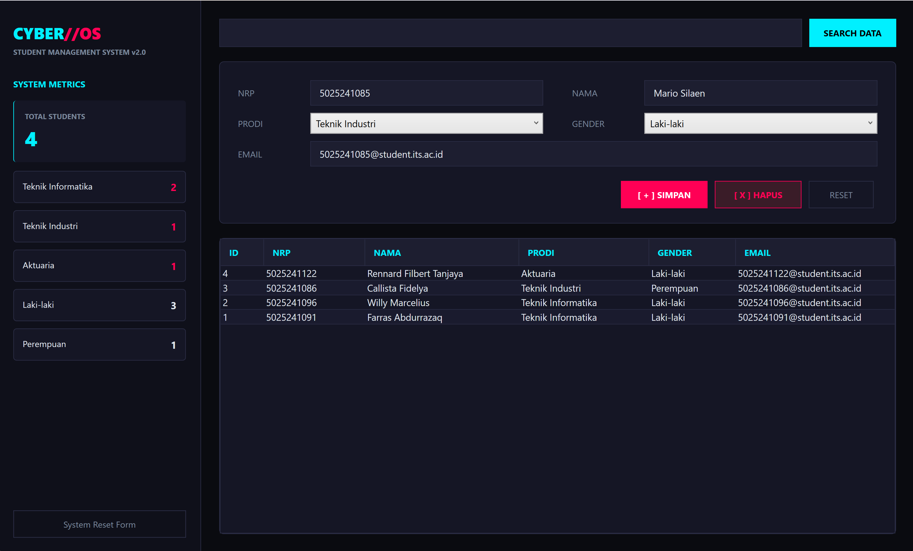
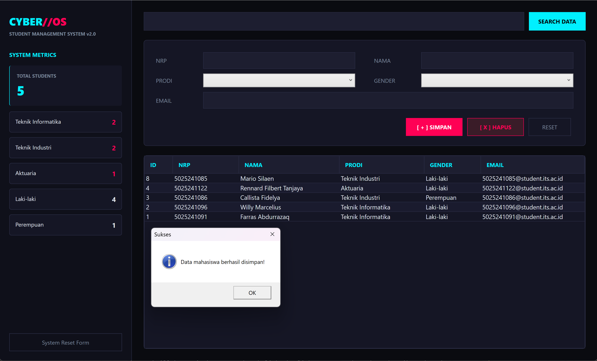
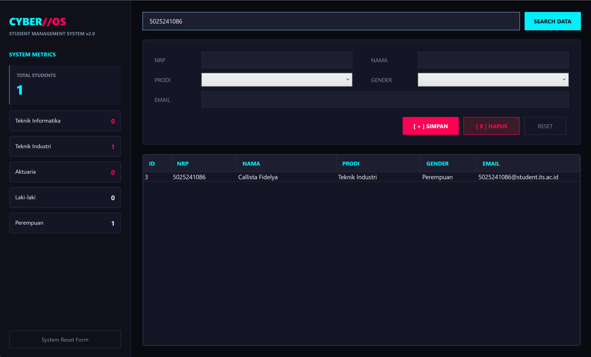
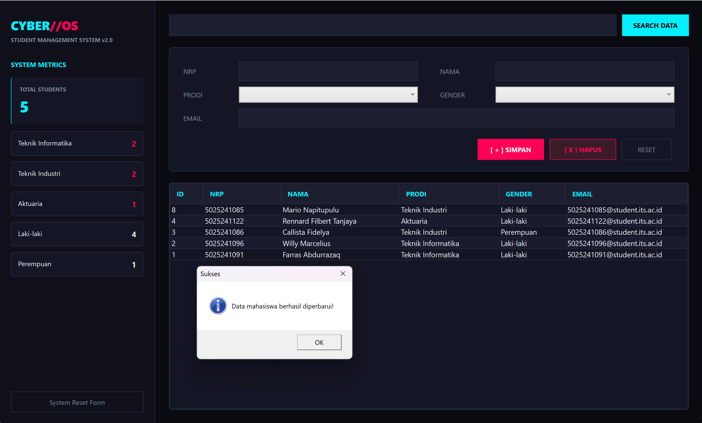
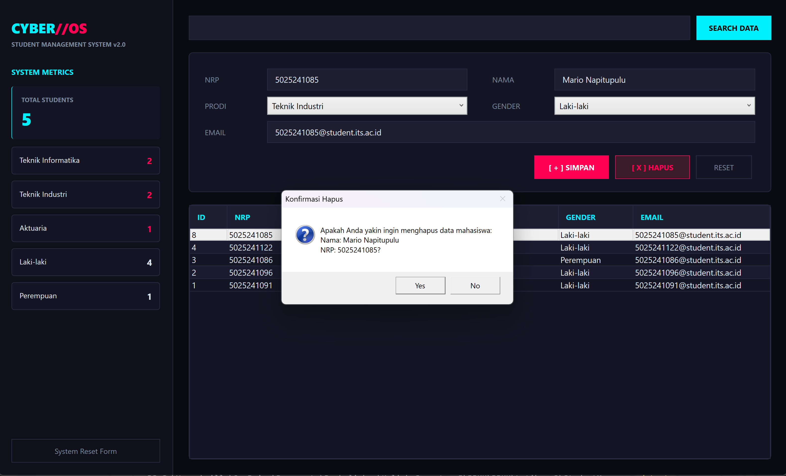
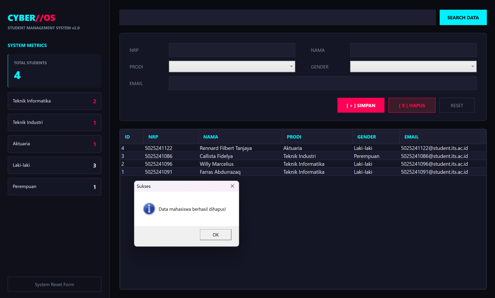
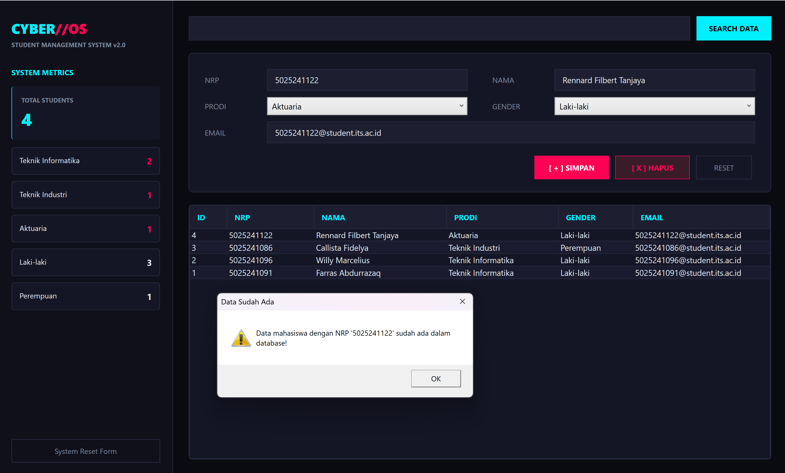
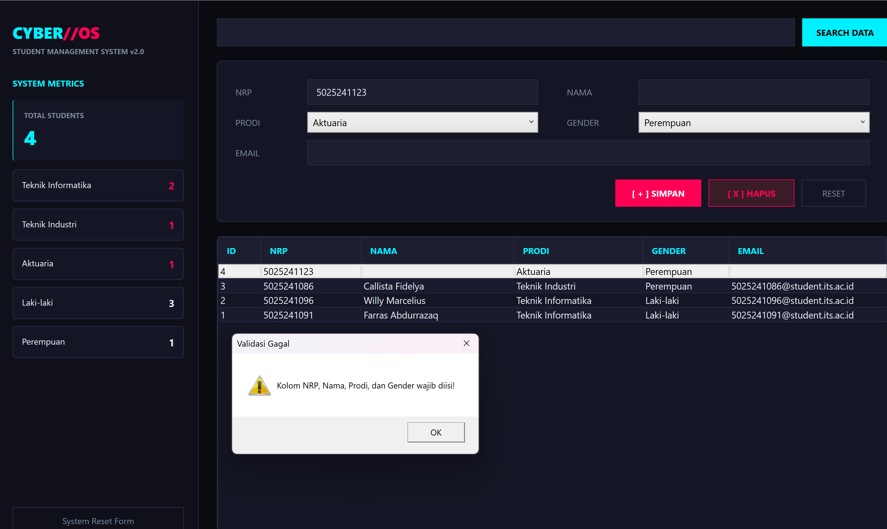
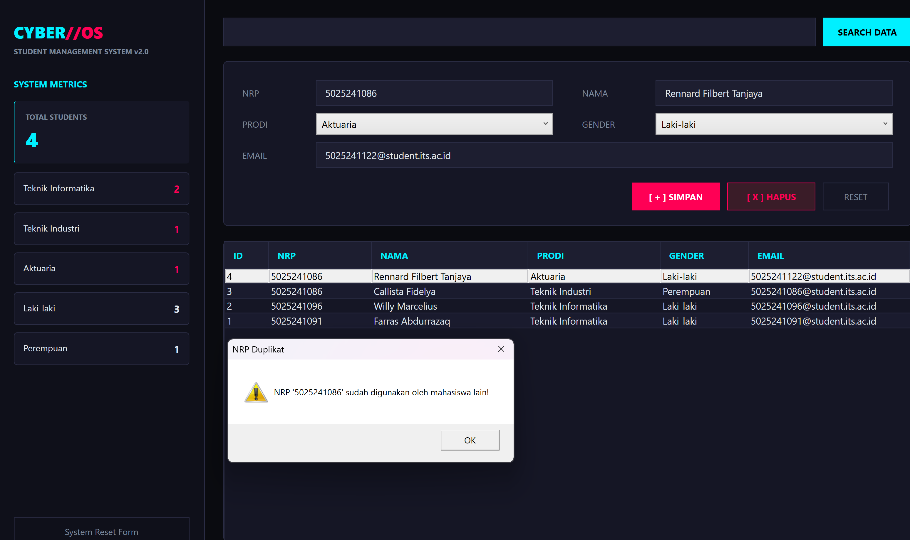

# Latihan 3 PBKK - Student Management System (WPF App)

| Nama | NRP | Mata Kuliah | Kelas |
| --- | --- | --- | --- |
| Willy Marcelius | 5025241096 | Pemrograman Berbasis Kerangka Kerja | D |

---

## Deskripsi

**Student Management System** adalah aplikasi desktop pengelola data mahasiswa berbasis **C# WPF (Windows Presentation Foundation)** dengan menerapkan pola arsitektur **MVVM (Model-View-ViewModel)** dan terhubung langsung ke database **SQL Server**.

Aplikasi ini didesain dengan antarmuka yang dilengkapi sidebar statistik real-time, pengolahan CRUD lengkap, pencarian data dinamis, serta validasi data dan penanganan error yang komprehensif.

---

## Build dan Inisialisasi

1. Inisialisasi project WPF:

   ```bash
   dotnet new wpf -n StudentManager
   ```

2. Masuk ke folder project:

   ```bash
   cd StudentManager
   ```

3. Install NuGet package SQL Server Client:

   ```bash
   dotnet add package Microsoft.Data.SqlClient
   ```

4. Jalankan aplikasi:

   ```bash
   dotnet run
   ```

---

## Fitur Utama

### Arsitektur MVVM (Model-View-ViewModel)###
Pemisahan logika bisnis (`StudentViewModel`), Data Access Layer (`StudentRepository`), model data (`Student`), dan tampilan antarmuka (`MainWindow.xaml`) secara independen menggunakan teknik **Data Binding dua arah (TwoWay)**.

### Statistik Real Time
Antarmuka futuristik bertema **Cyberpunk Slate Dark** dengan *left sidebar dashboard* untuk memantau metrik statistik real-time:
- Total Mahasiswa
- Sebaran Prodi Teknik Informatika & Teknik Industri
- Rasio Gender

### Operasi CRUD Lengkap (Create, Read, Update, Delete)
- **Create / Insert**: Penambahan data mahasiswa baru dengan validasi form input wajib dan proteksi duplikasi NRP.
- **Read**: Menampilkan seluruh record mahasiswa secara otomatis di `DataGrid` dengan kustomisasi *dark cyan header style*.
- **Update**: Pengeditan data terstruktur saat memilih baris tabel, dilengkapi validasi NRP bentrok dan deteksi *"no changes made"*.
- **Delete**: Penghapusan data berbasis seleksi baris `DataGrid` maupun pencarian NRP, dilengkapi dialog konfirmasi dan umpan balik (*feedback*).

### Filter & Search Engine
Pencarian data dinamis berdasarkan **NRP**, **Nama**, atau **Prodi** secara presisi disertai pop up feedback jika data tidak ditemukan.

### Validasi Data & Error Handling
Proteksi terhadap inputan kosong (`string.IsNullOrWhiteSpace`), penanganan error koneksi database, dan pencegahan manipulasi data ilegal melalui pesan dialog `MessageBox`.

---

## Tampilan Aplikasi

### Tampilan Utama & Dashboard


### Operasi CRUD & Form Management
1. Create -> Menambahkan data baru





2. Read -> Menampilkan Data



3. Update -> Memperbarui data yang sudah ada



4. Delete -> Menghapus data





### Validasi & Penanganan Feedback Error
1. User menambahkan data baru yang sama persis dengan data yang sudah ada



2. User tidak memberikan input data yang lengkap



3. User memberikan input NRP yang duplikat



---

## Struktur Proyek

| File / Folder | Fungsi |
| --- | --- |
| `Models/Student.cs` | Model data C# yang merepresentasikan entitas Student (Id, NRP, Nama, Prodi, Gender, Email). |
| `Data/StudentRepository.cs` | Data Access Layer (DAL) untuk menangani operasi I/O database SQL Server menggunakan ADO.NET (`Microsoft.Data.SqlClient`). |
| `ViewModels/StudentViewModel.cs` | ViewModel yang mengelola state aplikasi, `ObservableCollection`, logika statistik, validasi input, dan perintah (`ICommand`). |
| `ViewModels/RelayCommand.cs` | Implementasi interface `ICommand` untuk mengikat aksi tombol GUI di XAML ke method pada ViewModel. |
| `MainWindow.xaml` | User Interface (GUI) utama dengan tata letak Sidebar Dashboard, Form Input, dan DataGrid bertema Cyberpunk. |
| `MainWindow.xaml.cs` | Code-behind XAML yang menginisialisasi komponen dan mengatur `DataContext` ke `StudentViewModel`. |
| `App.xaml` / `App.xaml.cs` | File konfigurasi utama aplikasi WPF dan penentuan `StartupUri`. |

---

## Penjelasan Singkat Alur Kerja

1. MVVM Data Binding & State Management
Penggunaan `ObservableCollection<Student>` yang dikombinasikan dengan interface `INotifyPropertyChanged` memastikan setiap perubahan data pada koleksi (tambah, edit, hapus, cari) secara otomatis merefleksikan pembaruan ke `DataGrid` dan panel statistik tanpa perlu merender ulang GUI secara manual.

2. Isolated Data Access Layer (DAL)
`StudentRepository` mengisolasi seluruh interaksi SQL (`SqlConnection`, `SqlCommand`, `SqlDataReader`). Penggunaan *parameterized queries* (`@NRP`, `@Nama`, dll.) diterapkan di seluruh method CRUD untuk menjamin keamanan dari serangan **SQL Injection**.

3. Data Integrity & Duplication Prevention
Saat menekan tombol **Simpan**, sistem mengecek properti `Id`:
- **Mode Insert (`Id == 0`)**: Memicu method `IsNrpExists()` untuk menolak pendaftaran NRP yang sudah ada di database.
- **Mode Update (`Id > 0`)**: Memicu method `IsNrpExistsForOtherStudent()` untuk mencegah bentrok NRP dengan mahasiswa lain, serta menggunakan `GetById()` untuk memverifikasi apakah ada perubahan data sebelum mengeksekusi query `UPDATE`.

4. Interactive Dialog Feedback
Setiap alur kerja utama, mulai dari kegagalan koneksi database saat startup, form wajib yang belum diisi, upaya penghapusan data, hingga hasil pencarian kosong, dilengkapi dialog konfirmasi dan pemberitahuan kontekstual melalui `MessageBox`.
