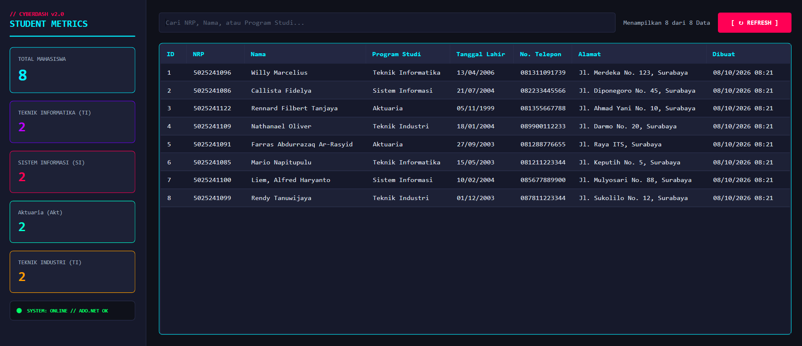
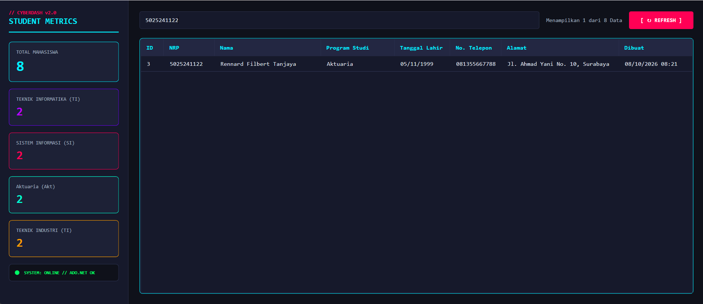
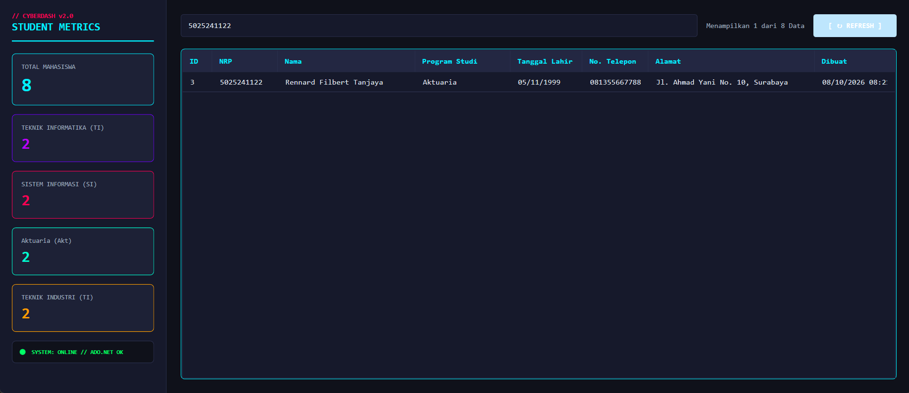

# Latihan 4 PBKK - Student Registration App (WPF + ADO.NET)

| Nama | NRP | Mata Kuliah | Kelas |
| --- | --- | --- | --- |
| Willy Marcelius | 5025241096 | Pemrograman Berbasis Kerangka Kerja | D |

---

## Deskripsi

**Student Registration App** adalah aplikasi desktop pemantauan data pendaftaran mahasiswa berbasis **C# WPF (Windows Presentation Foundation)** yang terhubung langsung ke database **SQL Server** menggunakan **ADO.NET (`Microsoft.Data.SqlClient`)** dengan menerapkan pola arsitektur **Repository Pattern**.

Aplikasi ini mengintegrasikan struktur database relasional **1:N (One-to-Many)** antara tabel `Programs` dan `Students`, dikemas dengan antarmuka futuristik bertema **Cyberpunk Slate Dark**, *left sidebar statistics dashboard*, pemfilteran pencarian dinamis secara *real-time*, serta penanganan error koneksi database yang handal.

---

## Build dan Inisialisasi

1. Inisialisasi project WPF:

   ```bash
   dotnet new wpf -n StudentRegistration
   ```

2. Masuk ke folder project:

   ```bash
   cd StudentRegistration
   ```

3. Install NuGet package SQL Server Client:

   ```bash
   dotnet add package Microsoft.Data.SqlClient
   ```

4. Eksekusi Script T-SQL Pembentukan Database (`StudentRegistrationDB`) di SSMS atau VS Code SQL Extension.

5. Jalankan aplikasi:

   ```bash
   dotnet build
   dotnet run
   ```

---

## Fitur Utama

### Arsitektur Repository Pattern & ADO.NET Data Access

Pemisahan logika akses data ke dalam kelas khusus `StudentRepository`. Pengolahan query dilakukan secara langsung menggunakan komponen ADO.NET low-level seperti `SqlConnection`, `SqlCommand`, dan `SqlDataReader` untuk performa eksekusi query yang efisien.

### Statistik Real Time

Antarmuka bertema **Cyberpunk Slate Dark** dengan *left sidebar dashboard* yang menampilkan indikator metrik terhitung secara otomatis dari SQL Server:

- Total Mahasiswa Terdaftar
- Distribusi Jumlah Mahasiswa per Program Studi:
  - Teknik Informatika/TC
  - Sistem Informasi/SI
  - Aktuaria/AKT
  - Teknik Industri/TI
- Indikator Status Koneksi Sistem (`SYSTEM: ONLINE // ADO.NET OK`)

### Integrasi Database Relasional (1:N)

Pemetaan data relasional antara tabel master `Programs` dan tabel transaksi `Students` menggunakan klausa SQL `INNER JOIN`. Aplikasi secara otomatis melakukan data binding kolom `ProgramName` hasil relasi tabel ke dalam `DataGrid`.

### Filter & Search Engine Dinamis

Fitur pencarian instan berdasarkan **NRP**, **Nama**, **Program Studi**, maupun **Alamat** secara *real-time* saat user mengetik pada kolom pencarian tanpa membebani server dengan query berulang.

### Umpan Balik & Error Handling

Proteksi terhadap kegagalan koneksi database (*database startup error*) menggunakan blok `try-catch` kontekstual yang menampilkan dialog pesan `MessageBox` bermakna jika koneksi SQL Server terputus atau gagal.

---

## Tampilan Aplikasi

- Tampilan Utama & Dashboard



- Live Search & Dynamic Filter



- Refreshed Data Monitor

Kembali ke tampilan awal Dashboard ketika user klik tombol `Refresh`




---

## Struktur Proyek

| File / Folder | Fungsi |
| --- | --- |
| `Models/Program.cs` | Model data C# yang merepresentasikan entitas master `Programs` (`ProgramId`, `ProgramCode`, `ProgramName`, `IsActive`). |
| `Models/Student.cs` | Model data C# yang merepresentasikan entitas `Students` beserta atribut penampung relasi `ProgramName`. |
| `Repositories/StudentRepository.cs` | Data Access Layer (DAL) berbasis ADO.NET yang mengeksekusi query SQL `INNER JOIN` dan membaca record data via `SqlDataReader`. |
| `MainWindow.xaml` | User Interface (GUI) utama dengan tata letak Left Sidebar Dashboard, Search Bar, dan DataGrid bertema Cyberpunk Dark. |
| `MainWindow.xaml.cs` | Code-behind XAML yang mengatur interaksi pencarian dinamis, komputasi statistik sidebar, dan event refresh data. |
| `App.xaml` / `App.xaml.cs` | File konfigurasi utama aplikasi WPF dan penentuan `StartupUri`. |

---

## Penjelasan Singkat Alur Kerja

1. ADO.NET Data Flow & Mapping Layer

Ketika aplikasi dijalankan, `MainWindow.xaml.cs` menginstansiasi `StudentRepository`. Method `GetAll()` membuka koneksi `SqlConnection` ke SQL Server `StudentRegistrationDB`, mengeksekusi `SqlCommand`, dan menggunakan `SqlDataReader` untuk membaca record baris demi baris sebelum dipetakan menjadi objek C# `List<Student>`.

2. Integrasi Data Relational (1:N INNER JOIN)

`StudentRepository` menjalankan query T-SQL `INNER JOIN Programs p ON s.ProgramId = p.ProgramId`. Pendekatan ini memungkinkan data nama program studi dipetakan langsung ke dalam properti `ProgramName` pada objek `Student` tanpa memerlukan query terpisah.

3. Dynamic Filtering & Real-Time Sidebar Metrics

Setiap kali dataset `List<Student>` berhasil ditarik, sistem secara otomatis mengeksekusi fungsi komputasi LINQ di memory untuk memperbarui counter Stat Cards pada sidebar (Total, TC, SI, AKT, TI). Input pencarian pada `TxtSearch` memfilter tampilan koleksi DataGrid secara fleksibel tanpa merender ulang seluruh komponen UI.

4. Resource Management & Exception Handling in ADO.NET

Penggunaan sintaks `using var` pada `SqlConnection`, `SqlCommand`, dan `SqlDataReader` menjamin bahwa seluruh unmanaged resource dan koneksi database akan ditutup dan dibersihkan dari memori secara otomatis segera setelah eksekusi query selesai, mencegah terjadinya memory leak atau connection pool exhaustion.